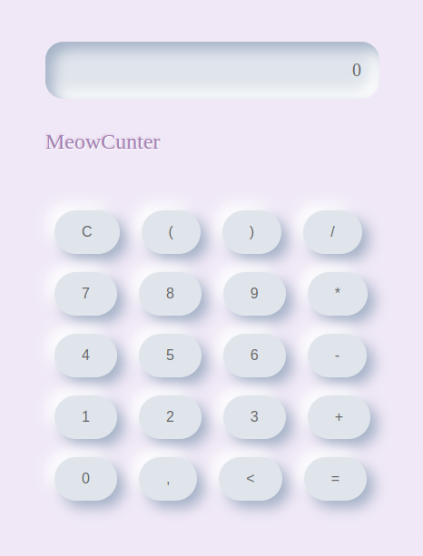

# MeowCounter - A Fun and Interactive Calculator



Welcome to MeowCounter, a delightful and user-friendly calculator app designed to make your calculations not only easy but also enjoyable. Whether you're crunching numbers for work, school, or just for fun, MeowCounter is here to help you with its intuitive interface and charming design.

## Features

MeowCounter comes packed with features that make it more than just your average calculator:

- **Basic Operations**: Perform all the basic arithmetic operations like addition, subtraction, multiplication, and division with ease.
- **Keyboard Support**: Enjoy the convenience of using your keyboard for quick inputs, including special keys for operations like calculate (`Enter`), clear (`Space`), and delete (`Backspace`).
- **Responsive Design**: Whether you're on a desktop, tablet, or mobile, MeowCounter's responsive design ensures a seamless experience across all devices.
- **Error Handling**: Avoid the frustration of calculation errors with friendly messages for situations like division by zero.
- **Stylish Effects**: Engage with a calculator that responds to your interactions with subtle animations, making your calculating experience visually pleasing.

## Getting Started

To get started with MeowCounter, simply clone this repository to your local machine:

```bash
git clone https://github.com/YourUsername/MeowCounter.git
